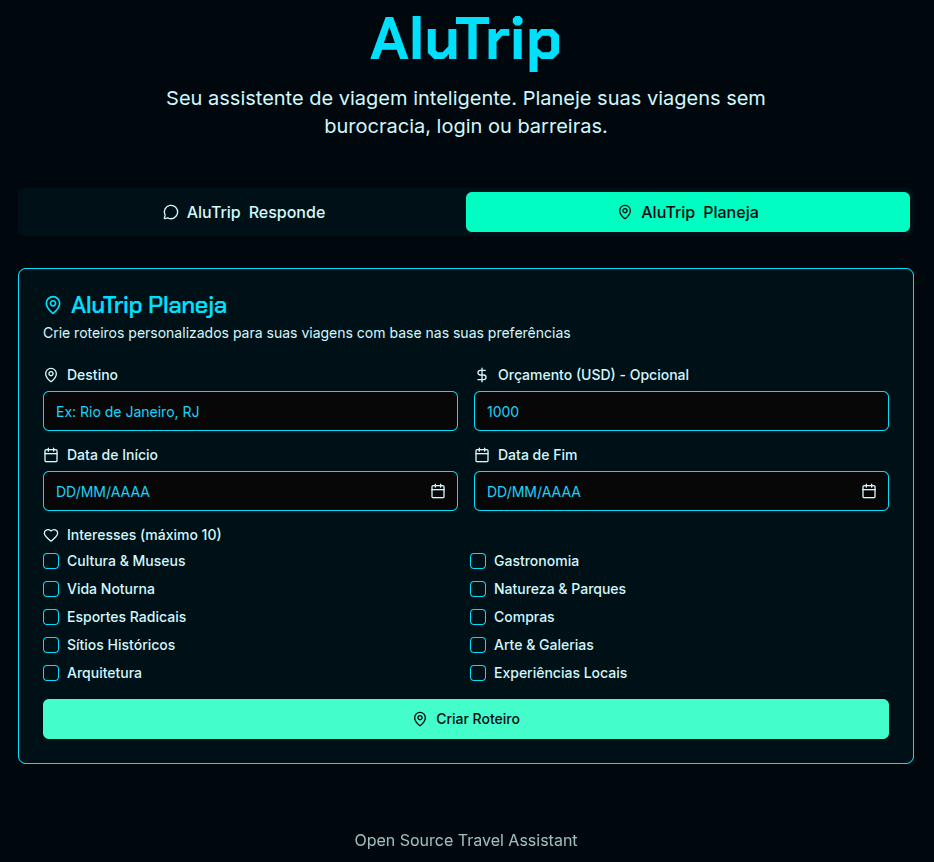

# AluTrip Travel Assistant

AluTrip is an intelligent travel assistant that offers two main features: **AluTrip Responde** for travel questions and **AluTrip Planeja** for creating personalized itineraries. The system consists of a Node.js/TypeScript backend API and a React/TypeScript frontend.

## 📸 Screenshots

### AluTrip Responde - Travel Q&A System

*Ask travel questions and receive intelligent AI responses*

### AluTrip Planeja - Itinerary Planning

*Create personalized itineraries based on your preferences*

## 🏗️ Architecture

The project follows a hybrid architecture with independent backend and frontend:

- **Backend** (`alutrip-backend/`): REST API in Node.js with TypeScript, Express.js, PostgreSQL and Redis
- **Frontend** (`alutrip-frontend/`): React interface with TypeScript, Tailwind CSS and Shadcn/ui

## 🚀 Features

### AluTrip Responde
- Travel Q&A system
- AI integration (Groq and Gemini)
- Intelligent and contextualized responses

### AluTrip Planeja
- Personalized itinerary creation
- Professional PDF generation
- Asynchronous request processing
- Intuitive interface for travel configuration

## 🛠️ Technologies

### Backend
- **Runtime**: Node.js 22.x
- **Language**: TypeScript (strict mode)
- **Framework**: Express.js
- **Database**: PostgreSQL + Redis
- **AI**: Groq SDK + Google Generative AI
- **Validation**: Zod schemas
- **Logging**: Winston
- **Queue**: Bull/BullMQ
- **PDF**: PDFMake

### Frontend
- **Framework**: React 19.1 + TypeScript
- **Styling**: Tailwind CSS + Shadcn/ui
- **Forms**: React Hook Form + Zod
- **Build**: Vite
- **Icons**: Lucide React

## 📋 Prerequisites

- Node.js >= 18.0.0 (Frontend) / >= 22.0.0 (Backend)
- npm >= 9.0.0 (Frontend) / >= 10.0.0 (Backend)
- Docker and Docker Compose (optional, but recommended)

## 🚀 How to Run

### Quick Start (Recommended)

The easiest way to start the entire AluTrip application is using the automated startup script:

```bash
# Start the complete application (Backend + Frontend)
./start-alutrip.sh
```

This script will:
1. ✅ Check prerequisites (Docker, .env file)
2. 🐳 Start all backend services (PostgreSQL, Redis, PgAdmin, Redis Commander)
3. ⏳ Wait for services to be ready
4. 🗄️ Run database migrations
5. 🎨 Start the frontend
6. 🌐 Display all access URLs

**To stop all services:**
```bash
# Stop all services
./stop-alutrip.sh
```

### Manual Setup (Advanced)

If you prefer to run services manually or need more control:

#### Backend

##### Option 1: Docker (Recommended)

```bash
# Navigate to backend directory
cd alutrip-backend

# Start all services (including backend)
npm run dc:up

# Wait for services to be ready (30-60 seconds)
# Check container status
npm run dc:ps

# Run database migrations
npm run migrate:dev up

# Check migration status
npm run migrate:dev status

# Check logs
npm run dc:logs

# Stop services
npm run dc:down
```

##### Option 2: Local Development

```bash
# Navigate to backend directory
cd alutrip-backend

# Start PostgreSQL, Redis, PgAdmin and Redis Commander
npm run dc:up -- postgres redis pgadmin redis-commander

# Wait for services to be ready (30-60 seconds)
# Check container status
npm run dc:ps

# Run database migrations
npm run migrate:dev up

# Check migration status
npm run migrate:dev status

# Install dependencies and run in development mode
npm install
npm run dev
```

**Services available after starting containers:**
- PostgreSQL: `localhost:5432`
- Redis: `localhost:6379`
- PgAdmin: `http://localhost:8080` (admin@alutrip.com / your_pgadmin_password)
- Redis Commander: `http://localhost:8001` (admin / your_redis_commander_password)

#### Frontend

##### Option 1: Docker (Recommended)

```bash
# Navigate to frontend directory
cd alutrip-frontend

# Start frontend with Docker
npm run dc:up

# Check logs
npm run dc:logs

# Stop services
npm run dc:down
```

##### Option 2: Local Development

```bash
# Navigate to frontend directory
cd alutrip-frontend

# Install dependencies
npm install

# Run in development mode
npm run dev
```

## 🌐 Service Access

After running the systems:

- **Frontend**: http://localhost:5173
- **Backend API**: http://localhost:3000
- **API Documentation**: http://localhost:3000/docs
- **Health Check**: http://localhost:3000/health
- **PgAdmin**: http://localhost:8080
- **Redis Commander**: http://localhost:8001

## ⚙️ Configuration

### Environment Variables

Create a `.env` file in the `alutrip-backend/` directory based on `.env.example`:

```bash
# Database
POSTGRES_USER=alutrip_user
POSTGRES_PASSWORD=your_postgres_password

# Redis
REDIS_URL=redis://localhost:6379

# AI Providers (required for full functionality)
GROQ_API_KEY=your-groq-api-key
GEMINI_API_KEY=your-gemini-api-key

# Rate Limiting
RATE_LIMIT_REQUESTS=5
RATE_LIMIT_WINDOW=86400000

# Admin Tools
PGADMIN_EMAIL=admin@alutrip.com
PGADMIN_PASSWORD=your_pgadmin_password
REDIS_COMMANDER_USER=admin
REDIS_COMMANDER_PASSWORD=your_redis_commander_password
```

### API Keys

For full functionality, configure the API keys:

1. **Groq**: Get it at https://console.groq.com/
2. **Gemini**: Get it at https://makersuite.google.com/app/apikey

## 🧪 Testing

### Backend

```bash
cd alutrip-backend

# Run tests
npm test

# Run tests with coverage
npm run test:coverage

# Run tests in watch mode
npm run test:watch
```

## 📊 Monitoring

### Logs

Backend logs are saved in:
- `logs/error.log` - Errors only
- `logs/combined.log` - All logs
- `logs/ai-operations.log` - AI operations

### Health Checks

- Backend: `GET /health`
- Database: Automatic connection verification
- Redis: Automatic connection verification

## 🔧 Useful Commands

### Root Project Commands

```bash
# Quick start (recommended)
npm start                    # Start complete application
npm run stop                 # Stop all services
npm run dev                  # Alias for npm start

# Setup and build
npm run setup                # Install dependencies for both projects
npm run build                # Build both projects for production

# Testing and quality
npm test                     # Run backend tests
npm run test:coverage        # Run tests with coverage
npm run lint                 # Check code quality
npm run lint:fix             # Fix lint issues
npm run format               # Format code
```

### Backend

```bash
# Development
npm run dev                    # Run in development mode
npm run build                  # Build for production
npm run start                  # Run production build

# Database
npm run migrate:dev up         # Run migrations
npm run migrate:dev down       # Revert migrations

# Docker
npm run dc:up                  # Start containers
npm run dc:down                # Stop containers
npm run dc:ps                  # Container status
npm run dc:logs                # View container logs

# Code quality
npm run lint                   # Check code
npm run lint:fix               # Fix lint issues
npm run format                 # Format code
```

### Frontend

```bash
# Development
npm run dev                    # Run in development mode
npm run build                  # Build for production
npm run preview                # Preview build

# Docker
npm run dc:up                  # Start container
npm run dc:down                # Stop container
npm run dc:ps                  # Container status
npm run dc:logs                # View container logs

# Code quality
npm run lint                   # Check code
npm run lint:fix               # Fix lint issues
npm run format                 # Format code
npm run type-check             # Check TypeScript types
```

## 🛡️ Security

- **No Authentication**: Open system for all users
- **Rate Limiting**: IP-based limitation (5 requests per 24h per feature)
- **Validation**: Strict input validation with Zod
- **CORS**: Proper configuration for frontend
- **Headers**: Security headers with Helmet

## 📚 Documentation

- **API**: Swagger documentation available at `/docs`
- **Postman Collection**: Complete collection for API testing in `postman-collection.json`
- **Backend**: `alutrip-backend/README.md`
- **Frontend**: `alutrip-frontend/README.md`
- **Architecture**: `alutrip-backend/docs/architecture.md`

### Testing the API with Postman

To facilitate API testing, you can use the Postman collection included in the project:

1. **Import Collection**:
   - Open Postman
   - Click "Import" and select the `postman-collection.json` file
   - The "AluTrip Backend API" collection will be imported with all requests configured

2. **Configure Variables**:
   - The collection is already configured with the `baseUrl` variable pointing to `http://localhost:3000`
   - If needed, adjust the base URL in the collection variables

3. **Available Tests**:
   - **Health Check**: API health verification
   - **Travel Q&A**: Travel questions and answers system tests
   - **Itinerary Planning**: Itinerary creation and management tests
   - **Test Scenarios**: Validation, rate limiting and error handling scenarios

4. **Run Tests**:
   - Make sure the backend is running (`npm run dev`)
   - Execute requests individually or use Postman Runner for automated testing
   - The collection includes automatic response and execution time validations

## 🤝 Contributing

1. Fork the project
2. Create a branch for your feature (`git checkout -b feature/AmazingFeature`)
3. Commit your changes (`git commit -m 'feat: add some AmazingFeature'`)
4. Push to the branch (`git push origin feature/AmazingFeature`)
5. Open a Pull Request

## 📄 License

This project is licensed under the MIT License. See the `LICENSE` file for more details.

## 🆘 Support

For questions or issues:

1. **Quick Start Issues**: If the automated script fails:
   - Check if Docker is running: `docker info`
   - Verify .env file exists in `alutrip-backend/`
   - Check container status: `cd alutrip-backend && npm run dc:ps`
   - View logs: `cd alutrip-backend && npm run dc:logs`

2. **Manual Troubleshooting**:
   - Check logs in `alutrip-backend/logs/`
   - Consult API documentation at `/docs`
   - Check container status with `npm run dc:ps`
   - Open an issue in the repository

3. **Common Issues**:
   - **Port conflicts**: Make sure ports 3000, 5173, 5432, 6379, 8080, 8001 are available
   - **Docker not running**: Start Docker Desktop or Docker daemon
   - **Permission issues**: Make sure scripts are executable (`chmod +x *.sh`)
   - **Environment variables**: Check if API keys are properly configured in `.env`

---

**AluTrip** - Your intelligent travel assistant, no bureaucracy, no login, no barriers! 🌍✈️